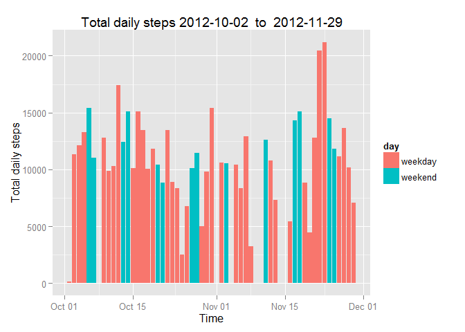
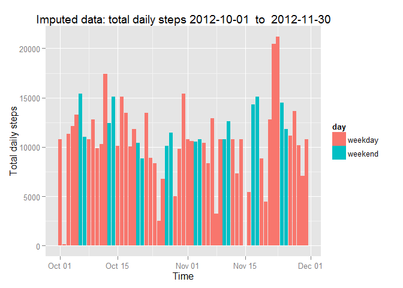
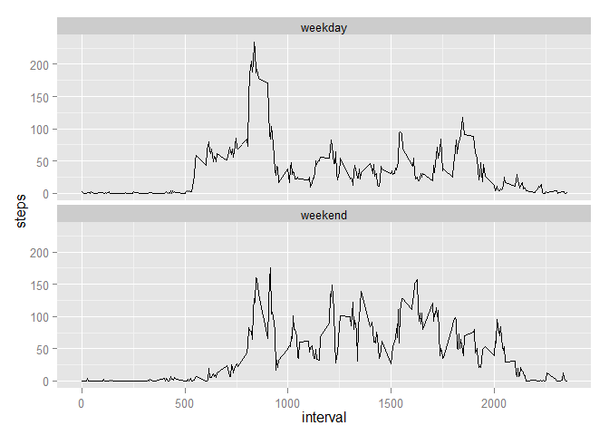

# Reproducible Research: Peer Assessment 1
  
  
## Loading and preprocessing the data  
  
Load the data and fix the date format  

```r
setwd("~/R/RepData_PeerAssessment1")
library("ggplot2")
library("plyr")

## numbers >= 10^5 will be denoted in scientific notation,
## and rounded to 2 digits
options(scipen = 1, digits = 2)


#Set file variables
fileurl <- "https://d396qusza40orc.cloudfront.net/repdata%2Fdata%2Factivity.zip"
zipname <- "./data/repdata-data-activity.zip"
filename <- ("./data/activity.csv")
#Get data
if (!file.exists("data")) {
        dir.create("data")
        }
if (!file.exists(zipname)){
        download.file(fileurl, destfile=zipname, mode="wb")
        unzip(zipname, exdir="./data")
        dateDownloaded <- date()
        write(dateDownloaded, file = paste("./data/datedownloaded.txt"))
}

#show date downloads
readLines("./data/datedownloaded.txt")
```

```
## [1] "Sat Jul 19 00:32:04 2014"
```

```r
#read file
data <- read.csv(filename, colClasses=c("integer","character", "integer"))
data$date <- as.Date(data$date, format="%Y-%m-%d")
```
  
## What is mean total number of steps taken per day?

```r
dailysteps <- aggregate(steps~date,data=data, FUN=sum)
day <- as.factor(weekdays(dailysteps$date) %in% c("Saturday", "Sunday"))
levels(day) <- c("weekday", "weekend")
s <- ggplot(dailysteps, aes(x=date,y=steps, fill=day))
s <- s + geom_bar(stat="identity")
s <- s + ylab("Total daily steps") + xlab("Time")
s <- s + labs(title=paste("Total daily steps", min(dailysteps$date), " to ", max(dailysteps$date)), fill="day")
s
```

 

```r
# calculate mean and median
dailymean <- mean(dailysteps$steps)
dailymedian <- median(dailysteps$steps)
```
  
Every day the mean steps taken are: 10766.19 and the median steps taken are: 10765  
  
  
## What is the average daily activity pattern?

```r
intervalsteps <-  aggregate(steps~interval,data=data, FUN=mean, na.rm=TRUE)
s <- ggplot(intervalsteps, aes(x=interval, y=steps))
s <- s + geom_line()
s
```

 

```r
maxsteps <- intervalsteps[intervalsteps$steps==max(intervalsteps$steps),1]
```

The 835 interval contains the maxium number of steps  
## Imputing missing values

```r
missingsteps <- table(is.na(data$steps))[2]
```
  
There are 2304 number of missing values in the dataset.


A rather simple but efficiet way to fill in the missing values is to take the mean of the time interval. A drawback of this is that we end up with fraction steps. So we need to write a function that replaces the steps values of an x if these are NA with the mean of x. This function can then be applied with ddply from the plyr package using the intervals as factors.  The result is saved in a new dataset data2.  


```r
impute.mean <- function(x) replace(x, is.na(x), mean(x, na.rm = TRUE))
data2 <- ddply(data, ~as.factor(interval), transform, steps=impute.mean(steps), date=date)
# lets reorder again according to date
data2 <-data2[order(data2$date), ]
```

Now we can plot the toatl daily steps from the new imputed dataset.  


```r
dailysteps2 <- aggregate(steps~date,data=data2, FUN=sum)
day <- as.factor(weekdays(dailysteps2$date) %in% c("Saturday", "Sunday"))
levels(day) <- c("weekday", "weekend")
s <- ggplot(dailysteps2, aes(x=date,y=steps, fill=day))
s <- s + geom_bar(stat="identity")
s <- s + ylab("Total daily steps") + xlab("Time")
s <- s + labs(title=paste("Imputed data: total daily steps", min(dailysteps2$date), " to ", max(dailysteps2$date)), fill="day")
s
```

 

```r
dailymean2 <- mean(dailysteps2$steps)
dailymedian2 <- median(dailysteps2$steps)
```

The new daily mean of 10766.19 from data2 with the imputed vlues is identical of the old daily mean of 10766.19. This is not surprising since we imputed the values from the mean steps of the interval. However, the new daily median 10766.19 is differnt from the old daily median 10765. This is not surprising since we include now more values that were before omited when calculating the median.  
  
One surprising feature of the data set was revealed when looking at the plotted total steps from the imputed data set. Two days had very low daily steps: 2012.10.02 and 2012.11.15. The minute interval of these days are predominately filled with zero steps. One can only assume that the study participant must have removed their activity monitor on these days or that the monitor was faulty.


## Are there differences in activity patterns between weekdays and weekends?  

Lets determine the weekdays as we already have done above.   


```r
data$day <- as.factor(weekdays(data$date) %in% c("Saturday", "Sunday"))
levels(data$day) <- c("weekday", "weekend")
```

We can aggregate the steps according to interval and day with the mean function.  


```r
intervalsteps <-  aggregate(steps~interval+day,data=data, FUN=mean, na.rm=TRUE)
s <- ggplot(intervalsteps, aes(x=interval, y=steps))
s <- s + geom_line()
s <- s + facet_wrap(~day, nrow = 2)
s
```

 
  
We can easy see that the activity pattern is different between weekdays and weekends. During the weekend the subject got up later and stayed up longer.  
